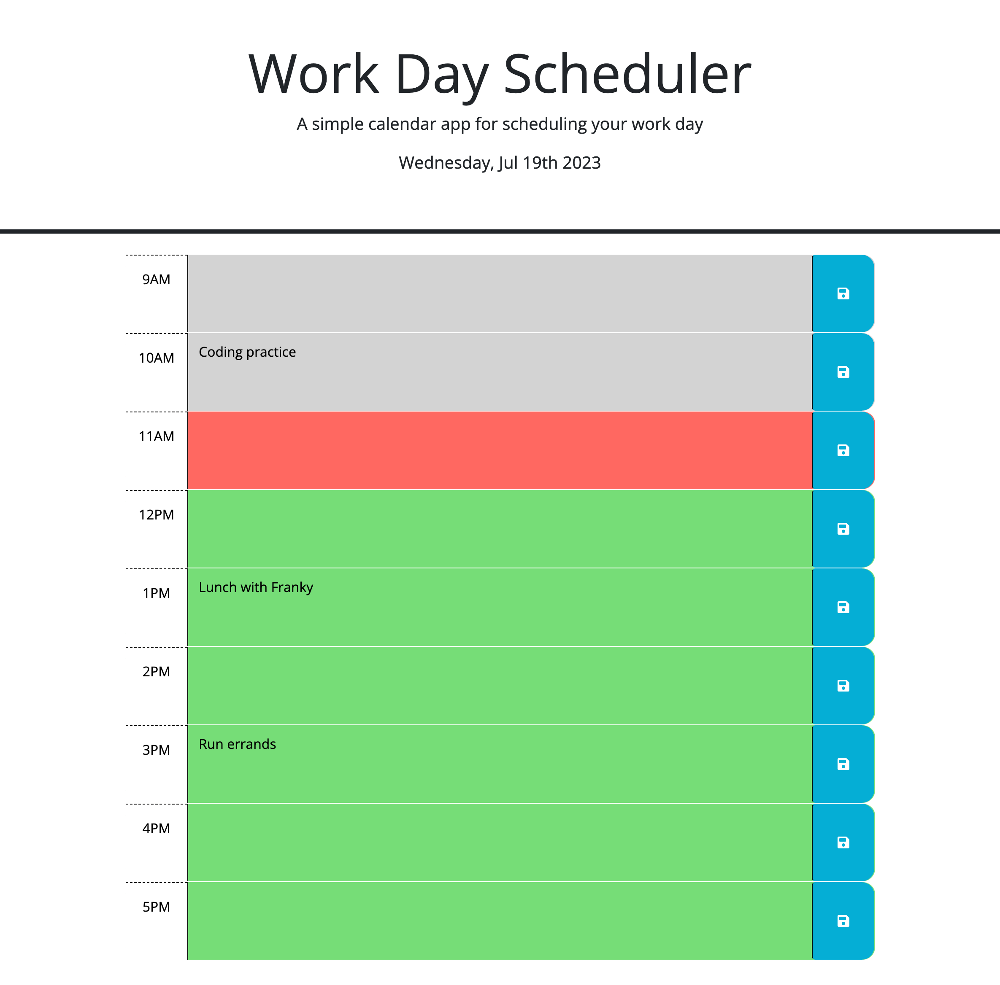

# Personal Workday Scheduler

## Description

This application serves as an hourly calendar for a typical work day (9am-5pm) and allows users to save events to each hour. A user can add a task to one of the hour blocks(or multiple), save it, and the task will persist when the page is refreshed. This application is largely powered by JQuery which actively reads and updates the HTML and CSS documents. The functionality of this webpage allows a user to plan and see what tasks they have planned for each hour of the day. The webpage makes reading the schedule and keeping track of time easy by utilizing Day.js to color code the hour blocks based off if the hour has passed, is the current hour or is in the future.

This web application was my introduction to using JQuery and all its eccentricities. While elbow deep in JQuery I feel that I have gained a deeper understanding and even appreciation for vanilla JavaScript and all that it has to offer. Day.js also proves to be a welcomed addition to my tools concerning time and dealing with any kind of time or timer in vanilla Javascript and JQuery alike. Surprisingly, this aplication also gave me new knowledge on strings and their utility. The way strings were utilized to display the date at the top of the page and to get an item from local storage and paste it in the correct element were ways I had not used strings before and proved to be very flexible.

## Installation

To run the code, clone the project directories from [my repository](https://github.com/sillytsundere/make-your-schedule) and open the index.html, style.css and script.js files in preferred code editor. The HTML file can be viewed to examine the basic display elements and how they are organized on the webpage. Styling elements from bootstrap can also be seen in the  HTML file. The Javascript file can be viewed to inspect the complex interactivity of the webpage. The style.css file can be viewed to examine the styling of the webpage. The Javascript file utilizes classes from the CSS file as well as ID's in the HTML file to generate interactivity on the webpage.

## Usage

The user enters a task into the text area and then clicks the save button to the right of the text area to save the calendar entry. This event saves the task into local storage which enables the task to persist after the page is refreshed or reloaded. The user can also add new tasks and edit any of the saved tasks and after saving the change, the new entry will persist.

Below is a screenshot of the webpage with pseudo entries to display its utility;

The deployed site can be reached at this link: https://sillytsundere.github.io/make-your-schedule/

## Support

Reach out to me if you have any questions at:

[My Github page](https://github.com/sillytsundere)

## Credits

Source code link: https://github.com/coding-boot-camp/crispy-octo-meme

Languages and libraries utilized to create this web application;

## License

